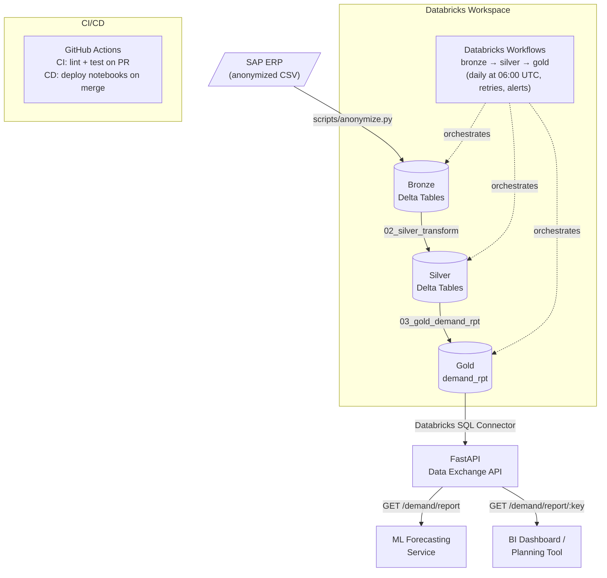

# Demand Planning — Data Exchange API

A production-grade data engineering showcase built on **Databricks** and **FastAPI**.

This project implements a full **Bronze → Silver → Gold medallion pipeline** that processes
anonymized SAP ERP data for demand planning, then exposes the curated output via a REST API
for integration with ML forecasting models, BI tools, and downstream applications.

> **Business context:** This pipeline was inspired by a real production system serving
> 6 manufacturing plants. It automates the preparation of demand data for time-series
> forecasting, previously done manually — supporting operations with significant
> annual revenue impact.

---

## Architecture



### Pipeline Stages

| Stage | Notebook | Input | Output | Key actions |
|-------|----------|-------|--------|-------------|
| **Bronze** | `01_bronze_ingestion.py` | CSV files (DBFS/UC Volume) | `bronze.*` Delta tables | Schema enforcement, ingestion metadata (`_ingested_at`, `_source_file`), DQ: not_null + unique on PKs |
| **Silver** | `02_silver_transform.py` | `bronze.*` | `silver.*` Delta tables | Type casting, joins (VBAK+VBEP+VBAP, MARA+MARC+MAKT), active-row filters, DQ log → `silver._dq_log` |
| **Gold** | `03_gold_demand_rpt.py` | `silver.*` | `gold.demand_rpt` | UOM conversion, enrichment with pricing and org structure, surrogate key (`sk_demand`), business KEY, DQ assertions |
| **API** | `src/api/` | `gold.demand_rpt` | REST endpoints | Paginated reads, filter by plant/order_type/KEY, typed Pydantic responses |

---

## Tech Stack

| Layer | Technology | Purpose |
|-------|-----------|---------|
| **Source data** | Anonymized CSV (SAP ERP export) | 10 ERP tables: VBAK, VBEP, VBAP, MARA, MARC, MAKT, MBEW, MVKE, MARM, CEPC |
| **Lakehouse storage** | Delta Lake (Databricks Free Edition) | ACID transactions, time travel, schema evolution for all 3 layers |
| **Data processing** | PySpark (Databricks Runtime 14.3) | Distributed UOM conversion, multi-table joins, windowed DQ checks — scales to millions of rows |
| **Orchestration** | **Databricks Workflows** | Multi-task DAG (bronze→silver→gold), cron schedule, retry on failure, email alerts |
| **REST API** | **FastAPI** + Databricks SQL Connector | Type-safe endpoints serving Gold layer; Pydantic v2 request/response validation |
| **Schema validation** | Pydantic v2 | API request/response models, data contracts |
| **Data quality** | Custom DQ framework (PySpark assertions) | `not_null`, `unique`, `positive_values`, date range checks; results persisted to `silver._dq_log` |
| **Testing** | pytest + httpx | 17 unit + integration tests; transformation logic + API endpoints; mocked DB for local runs |
| **Dependency management** | uv (Python 3.11) | Fast, reproducible virtual environments |
| **CI/CD** | **GitHub Actions** + Databricks CLI | CI: lint (ruff) + test on every PR; CD: auto-deploy notebooks + update Workflow on merge to `main` |
| **Secrets** | Databricks Secrets / `.env` (local) | Never committed; injected via GitHub Actions secrets or Databricks Secret Scope |
| **Local dev (API)** | WSL + podman | Container for local FastAPI testing without a Databricks connection |

---

## Data Keys

### Business Key — `KEY`
```
KEY = segment_profit_center + plant + material_number
```
The composite grain key used to group demand data for time-series forecasting.
One KEY represents all orders for a specific **material** at a specific **plant** within a **segment**.

### Surrogate Key — `sk_demand`
```sql
sk_demand = md5(order_number || '|' || order_item || '|' || schedule_line)
```
Unique row identifier with no business meaning. Used for deduplication and row tracking.

---

## Data Quality

DQ checks are applied at the **Silver** and **Gold** layers. All results are logged to `silver._dq_log`.

| Check | Tables | Columns |
|-------|--------|---------|
| `not_null` | All Silver/Gold tables | All primary/business key columns |
| `unique` | Silver + Gold | PK combinations per table |
| `positive_values` | `silver.orders`, `gold.demand_rpt` | `order_qty`, `net_price`, `quantity_base_uom` |
| `date_range` | `silver.orders`, `gold.demand_rpt` | `delivery_date >= 2015-01-01` |

---

## Project Structure

```
data-exchange-api/
├── .github/
│   └── workflows/
│       ├── ci.yml              # Lint + test on PR
│       └── cd.yml              # Deploy notebooks on merge to main
├── data/
│   └── anonymized/             # Anonymized sample data (CSV) — safe to commit
├── notebooks/
│   ├── 01_bronze_ingestion.py  # Bronze: CSV → Delta with schema enforcement
│   ├── 02_silver_transform.py  # Silver: clean, join, type-cast, DQ checks
│   └── 03_gold_demand_rpt.py   # Gold: demand report with UOM conversion + KEY
├── scripts/
│   └── anonymize.py            # Anonymizes raw SAP exports → data/anonymized/
├── src/
│   └── api/
│       ├── main.py             # FastAPI application entry point
│       ├── config.py           # Settings via pydantic-settings + .env
│       ├── db/
│       │   └── connector.py    # Databricks SQL connector wrapper
│       ├── routes/
│       │   └── demand.py       # GET /demand/report, GET /demand/report/{key}
│       └── schemas/
│           └── demand.py       # Pydantic response models
├── tests/
│   ├── test_transformations.py # Unit tests: Gold transform logic (8 tests)
│   └── test_api.py             # Integration tests: FastAPI endpoints (9 tests)
├── workflow/
│   └── demand_pipeline.json    # Databricks Workflow definition
├── .env.example                # Environment variable template
├── pyproject.toml              # uv project config, dependencies, ruff, pytest
└── README.md
```

---

## Setup

### Prerequisites
- Python 3.11+
- [uv](https://docs.astral.sh/uv/) package manager
- Databricks Free Edition workspace (for running notebooks)

### Local setup

```bash
# Clone and install dependencies
git clone https://github.com/<your-username>/data-exchange-api.git
cd data-exchange-api
uv sync

# Configure environment variables
cp .env.example .env
# Edit .env with your Databricks credentials

# Run tests (no Databricks connection required)
uv run pytest tests/ -v

# Start the API locally (requires .env configured)
uv run uvicorn src.api.main:app --reload
```

### Databricks setup

1. **Upload anonymized CSVs** to a DBFS path or Unity Catalog Volume:
   ```bash
   databricks fs cp -r data/anonymized/ dbfs:/Volumes/main/demand_planning/raw/
   ```

2. **Deploy notebooks** via GitHub Actions CD pipeline, or manually:
   ```bash
   databricks workspace import --language PYTHON notebooks/01_bronze_ingestion.py \
     /Repos/<user>/data-exchange-api/notebooks/01_bronze_ingestion
   ```

3. **Create the Workflow**:
   ```bash
   databricks jobs create --json @workflow/demand_pipeline.json
   ```

4. **Configure Widgets** in notebook `03_gold_demand_rpt.py`:
   - `plant_codes`: comma-separated list (e.g. `PLNT-01,PLNT-02,PLNT-03`)
   - `order_types`: comma-separated list (e.g. `ORD-TYPE-A,ORD-TYPE-B`)

### GitHub Actions secrets required

| Secret | Description |
|--------|-------------|
| `DATABRICKS_HOST` | `https://<workspace>.azuredatabricks.net` |
| `DATABRICKS_TOKEN` | Personal access token or service principal token |
| `DATABRICKS_USER` | Workspace username (for Repos path) |

---

## API Reference

Base URL: `http://localhost:8000` (local) or your deployed host.

### `GET /api/v1/demand/report`

Returns paginated demand report records from `gold.demand_rpt`.

**Query parameters:**
| Parameter | Type | Description |
|-----------|------|-------------|
| `plant` | string | Filter by plant code (e.g. `PLNT-01`) |
| `order_type` | string | Filter by order type |
| `key` | string | Filter by business grain KEY |
| `page` | int | Page number (default: 1) |
| `page_size` | int | Records per page (1–500, default: 50) |

**Example:**
```bash
curl "http://localhost:8000/api/v1/demand/report?plant=PLNT-01&page_size=10"
```

### `GET /api/v1/demand/report/{key}`

Returns all order lines for a specific business grain KEY.

```bash
curl "http://localhost:8000/api/v1/demand/report/SEG-001PLNT-01MAT-000001"
```

### `GET /health`
Liveness probe. Returns `{"status": "ok"}`.

---

## Business KPIs

| Metric | Description |
|--------|-------------|
| **Data freshness** | Pipeline runs daily at 06:00 UTC; Gold table updated before business hours |
| **Coverage** | 6 plants, multiple sales organizations, all active order types |
| **Grain** | One row = one schedule line per order item; enables unit-level demand tracking |
| **Downstream use** | Gold table feeds the ML time-series forecasting model that improved forecast accuracy by 15%, enabling €150K annual savings |

---

## Data Anonymization

All data in `data/anonymized/` has been anonymized from production SAP exports:

| Field | Original | Anonymized |
|-------|----------|------------|
| Material numbers (MATNR) | `3WA11202AB321AA0` | `MAT-000001` |
| Plant codes (WERKS) | `BX9S`, `BX9R`, ... | `PLNT-01`, `PLNT-02`, ... |
| Profit centers (PRCTR) | `P60901009` | `PC-0001` |
| Customer numbers (KUNNR) | `0040325398` | `CUST-0001` |
| Sales orders (VBELN) | `3003906938` | `ORD-000001001` |
| Person names (VERAK) | `Firstname Lastname` | _(removed)_ |
| Phone numbers (TELF1) | `+5511999999999` | _(removed)_ |
| Product names (ARKTX) | `REAGENTE N LATEX...` | `Product MAT-000001` |

Run `scripts/anonymize.py` to regenerate anonymized data from updated raw exports.
